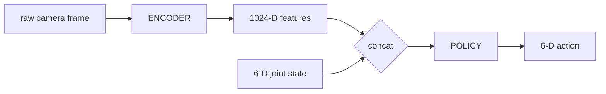

# so101_infer

C++ inference engine for the SO-101 robot policy (see, [Vision-Based Sim-to-Real Manipulation on the SO-101](https://github.com/matthewevans87/so101_sim_to_real)). Loads two independently-serialized TorchScript models and runs the full inference chain:




The project includes a GoogleTest parity suite that verifies numerical agreement with the Python/PyTorch reference within floating-point tolerance.

---

## Build

**Prerequisites**

- CMake ≥ 3.20
- C++17-capable compiler
- LibTorch (CPU, cxx11 ABI build) — download from [pytorch.org](https://pytorch.org/get-started/locally/) → *LibTorch → C++/Java → cxx11 ABI*

**Configure and compile**

```bash
cd ~/src/so101_infer
cmake -B build -DCMAKE_PREFIX_PATH=/path/to/libtorch
cmake --build build --parallel
```

This produces two binaries in `build/`:

| Binary        | Purpose                                                  |
| ------------- | -------------------------------------------------------- |
| `so101_infer` | End-to-end inference from raw `.bin` inputs              |
| `parity_test` | GoogleTest suite verifying C++ ↔ Python numerical parity |

---

## Usage

```
./build/so101_infer <encoder_in.bin> <joint_positions.bin> <encoder.pt> <policy.pt>
```

| Argument              | Description                                                                     |
| --------------------- | ------------------------------------------------------------------------------- |
| `encoder_in.bin`      | Raw little-endian float32, shape `(1, 3, 108, 192)` — preprocessed camera frame |
| `joint_positions.bin` | Raw little-endian float32, shape `(1, 6)` — current joint angles                |
| `encoder.pt`          | TorchScript encoder module (CNN → 1024-D features)                              |
| `policy.pt`           | TorchScript policy module (1030-D obs → 6-D mean action)                        |

Prints the output action shape and tensor values to stdout.

**Run the parity suite**

```bash
cd build && ctest --output-on-failure
# or directly:
./build/parity_test
```

---

## Examples

**End-to-end inference with the bundled fixtures**

```bash
./build/so101_infer \
    fixtures/encoder_in.bin \
    fixtures/e2e_joints.bin \
    models/encoder.pt \
    models/policy.pt
```

Expected output (values depend on your trained weights):

```
shape: [1, 6]
 0.8666  0.1399  0.1035 -0.8209  0.9959 -0.4367
[ CPUFloatType{1,6} ]
```

**Verifying parity against the Python reference**

```bash
./build/parity_test
# [  PASSED  ] 3 tests.
```

The suite tests three isolated stages to localize failures: encoder forward pass, observation assembly, and full end-to-end.
